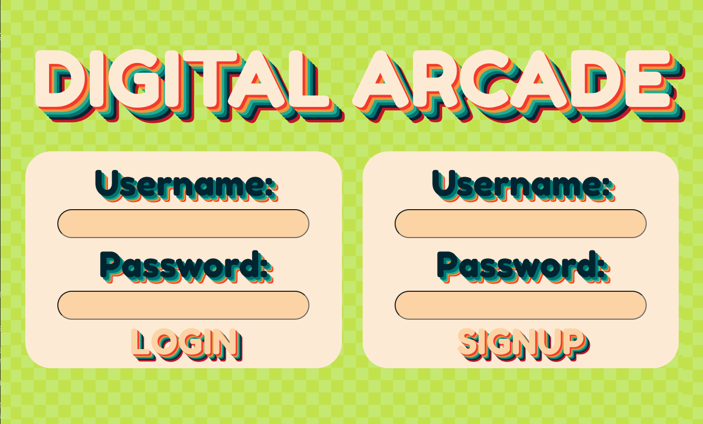
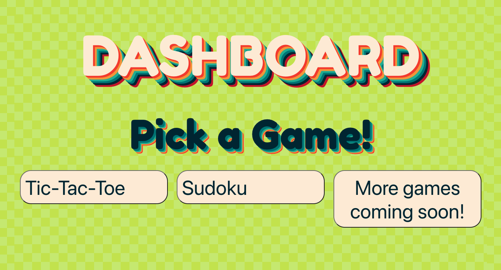
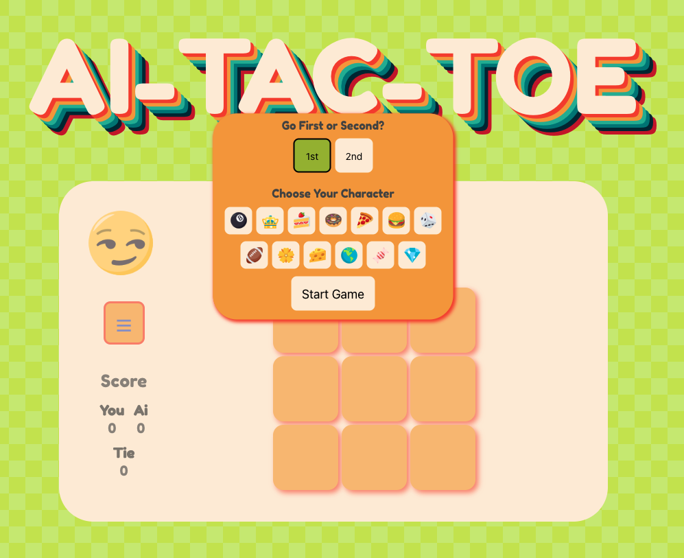
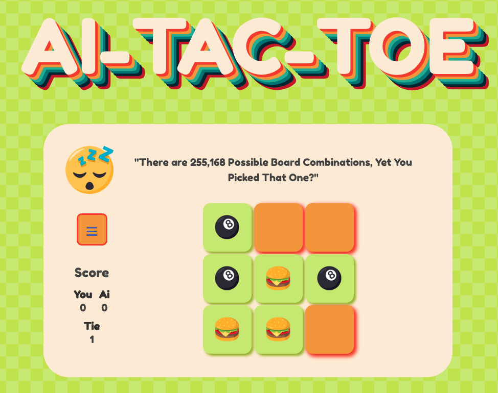

# Digital Arcade

## Overview

We've created a Digital Arcade!\
This arcade will be home to various single player and multiplayer games in future development.\
The website opens onto a login page, where a player is prompted for a username and password. If a player has not yet signed up, there is an option to do so on this same login page.

Once a player is logged in, they have access to the dashboard. The dashboard houses all currently available games.

The Tic-Tac-Toe game allows the player to play against a computer.

## Sources

- HTML
- CSS
- Javascript

## Website

Website deployed on Heroku:

Creators Julian Marshall & Jessica Gallo ❤️
